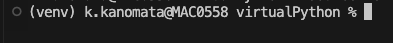

# Python 仮想環境（venv）を使った環境構築マニュアル
このマニュアルでは、Python の venv モジュールを使って仮想環境を構築する手順を説明します。仮想環境は、プロジェクトごとに独立したパッケージやライブラリのセットを管理できるようにするためのツールです。

<b>前提条件</b>

- Python 3.x がインストールされていること。
- 以下のコマンドで確認する。

```
$ python3 --version
```

## 1. プロジェクトディレクトリを作成する
まず、仮想環境を作成するプロジェクト用のディレクトリを作成します。

### ディレクトリを作成する

```
$ mkdir 自分の名前_project
```

### ディレクトに移動する

```
$ cd 自分の名前_project
```

## 2. 仮想環境を作成する
venv モジュールを使用して仮想環境を作成します。仮想環境のディレクトリ名は venv とします。

```
$ python3 -m venv venv
```
## 3. 仮想環境をアクティベートする
仮想環境をアクティベートします。これにより、仮想環境内の Python インタプリタとパッケージが使用されるようになります。

MacOS/Linux

```
$ source venv/bin/activate
```

アクティベートが成功すると、コマンドラインのプロンプトが (venv) のように変わります。



ターミナルにアップデート表示がでてくるのでアップデートしましょう。


## 4. パッケージをインストールする
仮想環境がアクティベートされた状態で、必要なパッケージをインストールします。例えば、requests パッケージをインストールする場合は以下のコマンドを実行します。

```
$ pip install requests
```

## 5. パッケージの一覧を保存する
プロジェクトで使用するパッケージの一覧を requirements.txt ファイルに保存します。これにより、他の開発者が同じ環境を再現するのが簡単になります。

```
$ pip freeze > requirements.txt
```

## 6. 仮想環境をデアクティベートする
仮想環境の使用が終わったら、デアクティベートして元のシェルに戻ります。

```
$ deactivate
```


## 他の開発者が同じ環境を再現する方法
他の開発者が同じ環境を再現するためには、requirements.txt ファイルを使ってパッケージをインストールします。

1. 仮想環境を作成してアクティベートする

- プロジェクトディレクトリに移動し、仮想環境を作成してアクティベートします。

```
$ python3 -m venv venv
$ source venv/bin/activate
```


2. パッケージをインストールする

- requirements.txt ファイルからパッケージをインストールします。

```
$ pip install -r requirements.txt
```